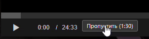

# Anime365_skip_opening
## Как установить?
1. Установить менеджер пользовательских скриптов [ViolentMonkey](https://violentmonkey.github.io/)
2. Перейти по ссылке для установки скрипта
3. Согласиться с установкой
4. Готово

Нажмите на название скрипта, чтобы установить его
* <a>[anime365_skip_opening](https://github.com/Lo373883/anime365_skip_opening/raw/main/anime_skip_script.user.js)
*  Для компьютера:
-Горячие клавиши: > или . для пропуска, < или , для смены времени
-Правая кнопка мыши (ПКМ) по кнопке для смены времени пропуска

*  Для телефона:
-Короткий тап - пропуск заставки
-Длинное нажатие (зажать) - смена времени пропуска

   
