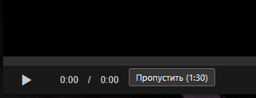

# Anime365_skip_opening
## Как установить?
1. Установить менеджер пользовательских скриптов. Рекомендуется [ViolentMonkey](https://violentmonkey.github.io/), но может работать и в TamperMonkey/GreasyMonkey.
2. Перейти по ссылке для установки скрипта
3. Согласиться с установкой
4. Готово

Нажмите на название скрипта, чтобы установить его
* <a>[anime365_skip_opening](https://github.com/Lo373883/anime365_skip_opening/blob/main/anime_skip_script.js)

   
